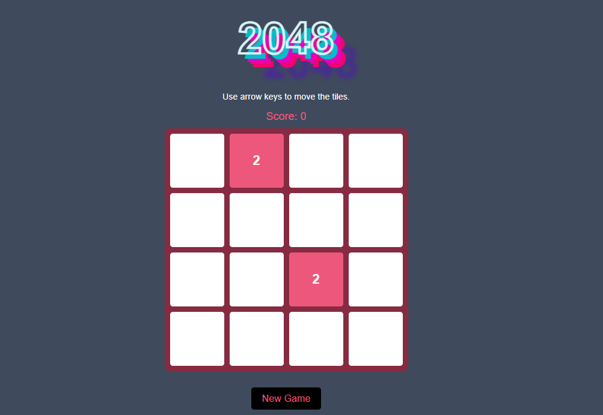

# 2048 Game - Classic Version 🎮

## Overview

This is a **classic 2048 game** built using **HTML, CSS, and JavaScript**. The objective is to slide and merge tiles to reach the **2048 tile**! Enjoy a smooth and responsive gameplay experience with intuitive controls.

## Features

- 🎨 **Sleek UI** with a dark theme and modern styling.
- 🎮 **Classic 2048 Gameplay** - Swipe or use arrow keys to merge tiles.
- 🔢 **Score Tracking** - Keep track of your highest score.
- 📱 **Responsive Design** - Works on both desktop and mobile devices.
- 💾 **New Game Button** - Restart anytime to challenge yourself again.

## How to Play

1. Use **arrow keys** (⬆️⬇️⬅️➡️) to move the tiles.
2. Tiles with the **same number** will merge when they collide.
3. The goal is to create a **2048 tile**.
4. Keep playing to achieve **higher scores**!

## Technologies Used

- **HTML** - For structuring the game layout.
- **CSS** - For styling and animations.
- **JavaScript** - For game logic and interactivity.

## Installation

To run the game locally, follow these steps:

```bash
git clone [https://github.com/yourusername/2048-game.git](https://github.com/EnjyRamadan/2048.git)
open home.html
```

## GUI




🚀 **Challenge yourself and reach 2048!**

